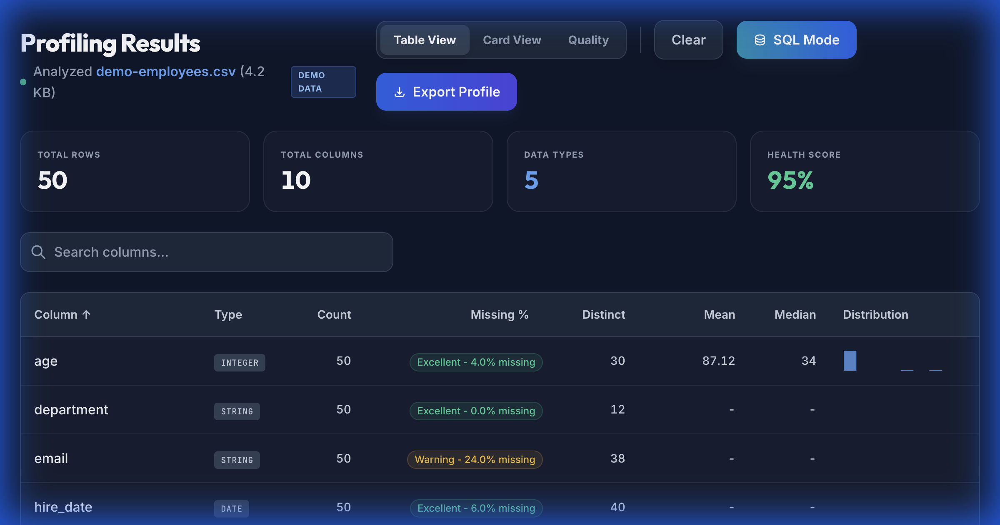

#  DataCert

**Certify your data quality instantly. No cloud. No upload. 100% Local.**

[](https://webassembly.org/)
[](https://www.solidjs.com/)
[](https://opensource.org/licenses/MIT)

---


**DataCert** is a high-performance, browser-based profiling suite designed for data engineers who value privacy and speed. By leveraging **Rust** compiled to **WebAssembly**, DataCert processes millions of rows directly on your device - your data never leaves your machine.

### ⚡ See it in Action


---

## 🚀 Why DataCert?

| 🛡️ Privacy First | 🏎️ Near-Native Speed | 🛠️ Zero dependencies |
| :--- | :--- | :--- |
| Processing happens entirely in your browser's memory. Safe for PII and sensitive internal data. | Rust/WASM streaming engine handles massive CSVs faster than Python-based alternatives. | No Python setup, no Docker, no Cloud console. Just drop your file and go. |

---

## ✨ Features

- **Comprehensive Profiling:** Instant health scores, data type detection, and statistical distribution charts.
- **SQL Mode:** Query local files using SQL syntax via **DuckDB-WASM**.
- **CLI for CI/CD:** Add quality gates to your pipelines with `npx datacert profile`.
- **Compare & Batch:** Detect schema drift between versions or profile entire directories at once.
- **Visual Insights:** Beautifully rendered histograms, correlation matrices, and PII alerts.



---

## 📈 Growth Strategy: "The Data Quality Swiss Army Knife"

Our mission is to make data profiling as ubiquitous as `ls` or `grep`.

### 1. The Hooks
- **"Private by Design":** We don't want your data. In an era of data leaks, DataCert is the only tool your compliance officer will approve instantly.
- **Instant Gratification:** From CSV to Profile in < 2 seconds. No login required.

### 2. Community Engagement
- **Show HN & Reddit:** Targetting `r/dataengineering` with the Rust-technical edge.
- **PLG Viral Loop:** Exportable HTML reports allow teams to share quality audits without sharing raw data access.

---

## 🛠️ Getting Started

### Web UI
1. Visit the hosted version (PWA supported).
2. Drag and drop any `.csv`, `.json`, `.parquet`, or `.xlsx` file.
3. Review your data health instantly.

### CLI Usage
For automated quality gates in CI/CD:

```bash
npx datacert profile data.csv --fail-on-missing 5
```
*See the [CLI Guide](docs/guides/cli.md) for more.*

---

## 🏗️ Technical Stack

- **Engine:** Rust (Edition 2021) + `wasm-bindgen`
- **UI:** SolidJS + Tailwind CSS
- **Query Engine:** DuckDB-WASM
- **Bundler:** Vite

---

## 🤝 Contributing & License

We welcome contributions! Check the `tickets/` directory for our current roadmap.

**License:** [MIT](LICENSE)
