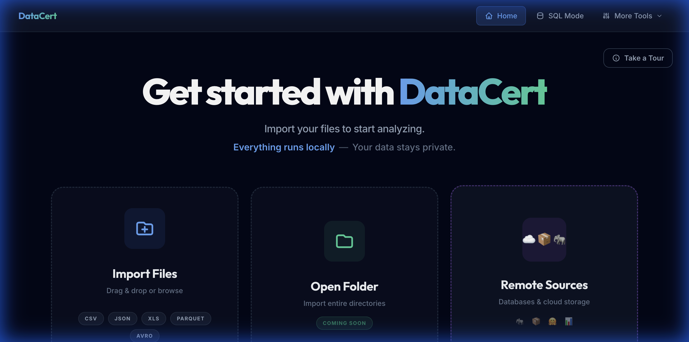
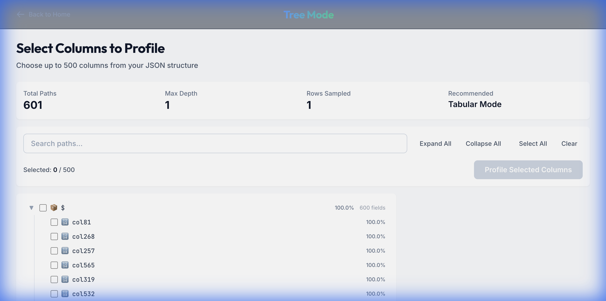
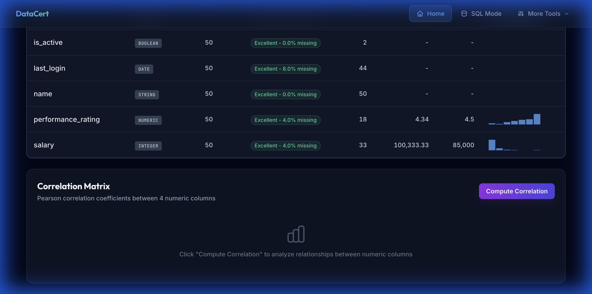
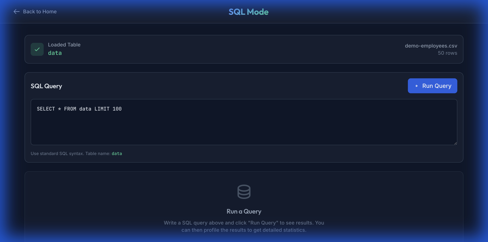

#  DataCert

**Certify your data quality instantly. No cloud. No upload. 100% Local.**

[](https://webassembly.org/)
[](https://www.solidjs.com/)
[](https://opensource.org/licenses/MIT)

---



**DataCert** is a high-performance, browser-based profiling suite designed for data engineers who value privacy and speed. By leveraging **Rust** compiled to **WebAssembly**, DataCert processes millions of rows directly on your device - your data never leaves your machine.

### ⚡ Quick Start

Jump in immediately from your terminal:

```bash
npx datacert
```

---

## 🚀 Why DataCert?

| 🛡️ Privacy First                                                                                | 🏎️ Near-Native Speed                                                                   | 🛠️ Zero dependencies                                                      |
| :---------------------------------------------------------------------------------------------- | :------------------------------------------------------------------------------------- | :------------------------------------------------------------------------ |
| Processing happens entirely in your browser's memory. Safe for PII and sensitive internal data. | Rust/WASM streaming engine handles massive CSVs faster than Python-based alternatives. | No Python setup, no Docker, no Cloud console. Just drop your file and go. |

---

## ✨ Features

### 📂 Intelligent Column Selection (Tree Mode)



### 📊 Professional Data Profiling



### 🦆 In-Browser SQL Engine



---

## 🎯 The Mission

Our goal is to make data profiling as ubiquitous as `ls` or `grep`. DataCert was built to be the "Data Quality Swiss Army Knife"—a tool that is always ready, requires zero setup, and treats your data with the privacy it deserves.

- **Private by Design:** We don't want your data. In an era of data leaks, DataCert ensures your PII and sensitive internal data never leave your browser's memory.
- **Instant Gratification:** From raw file to comprehensive profile in seconds. No login, no cloud configuration, no waiting.
- **Collaborative Audits:** High-fidelity reporting allows teams to share quality insights without ever needing to move the underlying datasets.

---

## 🛠️ Getting Started

### CLI & Local UI (Recommended)

The fastest way to use DataCert is via `npx`. This launches the profiler directly in your browser using your local machine for analysis:

```bash
npx datacert
```

### Automated Profiling (CI/CD)

Run headless profiling with pass/fail quality gates for your data pipelines:

```bash
npx datacert profile data.csv --fail-on-missing 5
```

_See the [CLI Guide](docs/guides/cli.md) for more._

---

## 🏗️ Technical Stack

- **Engine:** Rust (Edition 2021) + `wasm-bindgen`
- **UI:** SolidJS + Tailwind CSS
- **Query Engine:** DuckDB-WASM
- **Bundler:** Vite

---

## 🤝 Contributing & License

We welcome contributions! Check the `tickets/` directory for our current roadmap.

**License:** [MIT](LICENSE)
