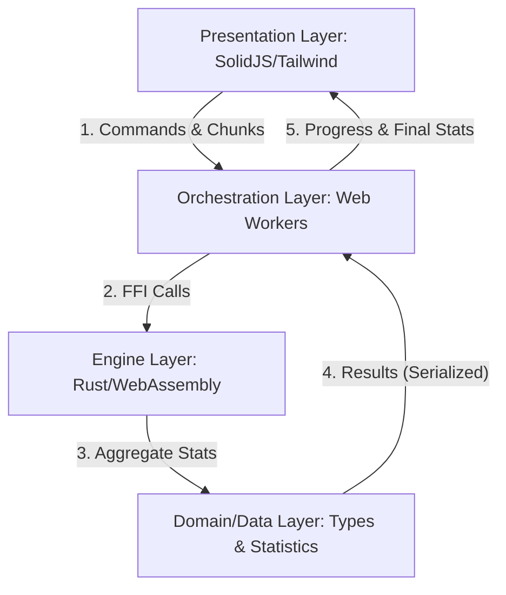

# DataCert Conceptual Architecture

DataCert is designed as a high-performance, local-first data profiling engine. To achieve this in a browser environment, it is decomposed into four conceptual layers.

## 1. System Decomposition

---

## 2. Layer Responsibilities & Constraints

| Layer | Responsibility | Constraints | What breaks without it? |
| :--- | :--- | :--- | :--- |
| **Presentation** | User Interface, routing, visualizations (charts), file selection. | Must remain responsive (60fps). | The system is a CLI-only tool; no visual feedback or ease of use. |
| **Orchestration** | Multi-threading, file streaming/buffering, routing tasks to WASM. | Cannot access DOM; uses `postMessage`. | The UI freezes during processing, making the app feel "broken". |
| **Engine** | High-performance parsing (CSV/Parquet/JSON) and statistical aggregation. | Memory safety; sandbox execution. | Processing large files (100MB+) becomes too slow for browser JS. |
| **Domain/Data** | Statistical logic (histograms, quantiles), quality rules, type definitions. | Pure logic; no I/O. | Statistics become inconsistent or buggy; no shared type safety. |

---

## 3. Interfaces & Communication

1.  **UI ↔ Worker (PostMessage):** Communicates via asynchronous events. Chunks of data are often "Transferred" (not copied) to save memory.
2.  **Worker ↔ WASM (FFI):** Synchronous calls into the Rust-compiled blob. Uses `serde-wasm-bindgen` for efficient object serialization.
3.  **WASM ↔ Domain:** Internal Rust module boundaries.

---

## 4. Incremental Build Guide (Learning Roadmap)

To understand this system deeply, build it in this order:

### Stage 1: The Core (Rust CLI)
Build a simple Rust CLI that reads a CSV file line-by-line and calculates the mean/max of a numeric column.
*   **Goal:** Master the `csv` crate and basic statistics logic.

### Stage 2: The Portal (WASM Integration)
Compile your Rust core to WASM using `wasm-pack`. Create a simple HTML page that calls a Rust function to profile a small hardcoded string.
*   **Goal:** Understand the binding boundary and JS/WASM interop.

### Stage 3: The Background (Web Workers)
Move the WASM call into a Web Worker. Send a file from the main thread to the worker chunk-by-chunk.
*   **Goal:** Handle multi-threading and prevent UI blocking.

### Stage 4: The Interface (SolidJS)
Build a reactive UI to display the results. Use `createSignal` to show "Rows Processed" in real-time.
*   **Goal:** Connect the worker events to a modern state-management system.

### Stage 5: The Optimizer (Streaming & Memory)
Implement streaming for large files (GBs). Instead of loading the whole file into memory, process chunks and only keep the *summary* in memory.
*   **Goal:** Master "Local-First" performance at scale.
